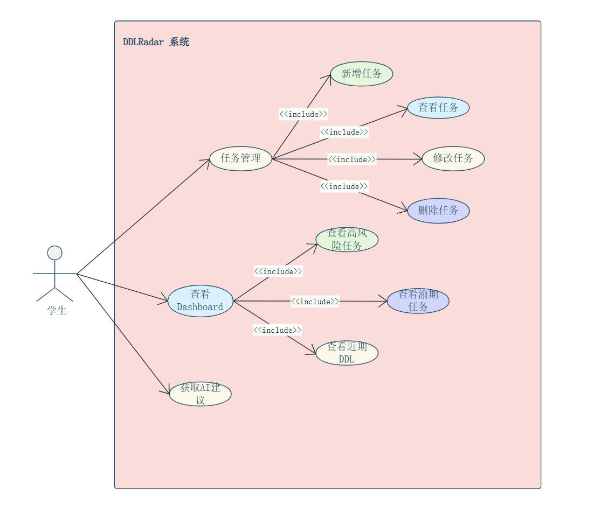
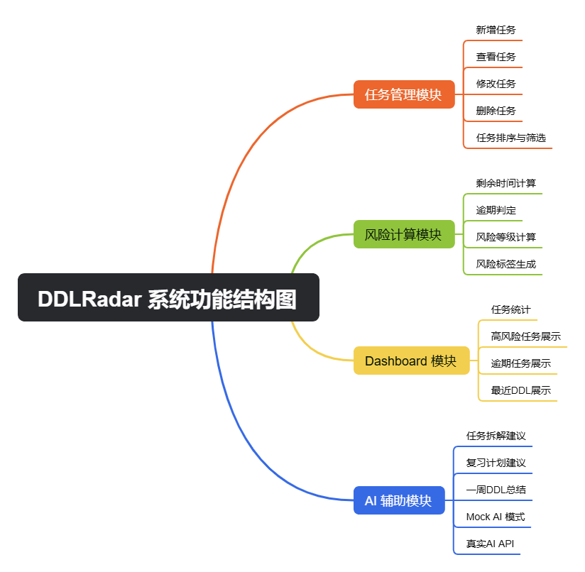

# DDLRadar 需求规格说明书

## 引言

### 编写目的

本文档为 DDLRadar 项目的软件需求规格说明书（Software Requirements Specification，SRS），主要用于明确系统功能需求、业务范围以及开发边界，为后续系统设计、编码实现、测试验证和项目答辩提供统一依据。  
本文档主要面向以下对象：  
1. 软件工程课程任课教师与项目评审人员；  
2. 项目组内各开发成员；  
3. 后续参与项目维护与扩展的开发人员。  
本文档主要用于指导需求分析、系统设计、接口开发、数据库设计、功能测试以及最终项目验收。

### 项目背景

在高校的日常学习中，学生通常面临着多门课程的作业、考试、课程项目等并发任务。传统的备忘录或简单的日历工具往往缺乏针对“截止日期（Deadline）”和“紧急程度”的动态管理。

本项目旨在开发一款面向学生的课程 DDL 管理系统，不仅能集中记录所有学业任务，还能通过自动计算风险等级以及提供 AI 辅助拆解建议，帮助学生缓解时间管理焦虑，提升执行效率。

### 定义与缩略语

- DDL：Deadline，任务截止时间。
- Dashboard：系统首页的数据统计与任务展示面板。
- CRUD：Create、Read、Update、Delete，即增删改查。
- SRS：Software Requirements Specification，软件需求规格说明书。
- MVP：Minimum Viable Product，最小可行产品。
- Mock AI：不调用真实 AI 服务，而通过模板生成固定建议的模拟 AI 功能。

### 参考资料

1. 《软件工程导论》（张海藩，第六版）
2. 软件工程课程项目任务书
3. Rust 官方文档
4. Axum 官方文档
5. SQLite 官方文档
6. RESTful API 设计规范相关资料

## 项目目标

### 基础目标：

实现一个可运行的 DDL 管理系统，支持：

- 新增任务
- 查看任务
- 修改任务
- 删除任务

等一个任务管理器能够实现的 CRUD 功能，保证系统能够稳定运行、功能闭环，交付作业时能够成功使用。

### 进阶目标：

在实现基础目标的基础上进一步优化产品功能，争取实现以下功能：

- 根据截止时间计算风险等级
- 展示 Dashboard 统计信息
- 提供 AI 辅助建议

通过实现这些功能使得产品比普通的日程管理器更具有特色。

### 后续目标：

后续可作为开源项目进一步优化代码结构、完善 README 并上传至 GitHub。

## 用户角色

本系统主要面向大学生用户，能够让用户更方便、高效地管理课程任务、查看任务状态、获取 AI 建议。

图1：学生可进行的操作

- 任务管理
    - 新增任务
    - 查看任务
    - 修改任务
    - 删除任务
- 查看dashboard
    - 查看高风险任务
    - 查看逾期任务
    - 查看近期DDL
- 获取AI建议

图 1 展示了学生用户在 DDLRadar 系统中的主要操作用例，包括任务管理、Dashboard 查看以及 AI 辅助建议获取等功能。

## 功能需求

### 系统功能概述

系统主要分为四大核心功能模块：任务管理、风险计算、Dashboard 看板展示以及 AI 辅助模块。


图2：
#### DDLRadar 系统功能结构图


##### 任务管理模块
- 新增任务
- 查看任务
- 修改任务
- 删除任务
- 任务排序与筛选

##### 风险计算模块
- 剩余时间计算
- 逾期判定
- 风险等级计算
- 风险标签生成

##### Dashboard 模块
- 任务统计
- 高风险任务展示
- 逾期任务展示
- 最近DDL展示

##### AI 辅助模块
- 任务拆解建议
- 复习计划建议
- 一周DDL总结
- Mock AI 模式
- 真实AI API

图 2 展示了 DDLRadar 系统的整体功能结构。系统主要由任务管理模块、风险计算模块、Dashboard 模块和 AI 辅助模块组成，各模块共同支撑课程 DDL 管理、风险分析和辅助规划功能。

### 任务管理模块

该模块是系统的基础数据支撑，提供对课程任务的完整生命周期管理。

#### 任务录入与新增

用户可以新增 DDL 任务，必须包含的内容有：标题、课程名称、任务类型、截止时间、优先级、状态以及任务描述。

#### 任务属性的规范

- **任务分类：** 支持标记为“作业”、“考试”、“课程项目”、“其他任务”四类。
- **状态管理：** 支持修改任务状态为“未开始”、“进行中”、“已完成”、“已逾期”。
- **优先级设定：** 支持设定为“低”、“中”、“高”三个等级。

#### 任务列表与检索

系统需在前端展示 DDL 任务列表，支持根据截止时间进行自动排序展示。

#### 任务修改与删除

支持对录入错误或发生变更的任务进行详情修改；支持对作废或提前完成任务的进行删除处理。

### 风险计算模块

该模块能够让用户无需手动标注风险，而是由后端自动根据规则进行计算。

#### 剩余时间计算

系统需读取任务的 deadline，并与当前系统时间进行差值计算。

#### 逾期判定

当系统时间超过 deadline 且任务状态不为“已完成”时，自动标记为“已逾期”。

#### 风险等级规则

综合“距离截止日期的剩余时间”、“任务自身优先级”和“当前完成状态”，系统自动生成风险等级并输出标签（低风险、中风险、高风险、已逾期、已完成）。

| 条件 | 风险等级 |
|------|----------|
| 状态为已完成 | 已完成 |
| 当前时间已超过 DDL 且未完成 | 已逾期 |
| 剩余时间 ≤ 1天 | 高风险 |
| 剩余时间 1天 < 剩余时间 ≤ 3天 且优先级为高 | 高风险 |
| 剩余时间 1天 < 剩余时间 ≤ 3天 且优先级不为高 | 中风险 |
| 剩余时间 3天 < 剩余时间 ≤ 7天 且优先级为高 | 中风险 |
| 剩余时间 3天 < 剩余时间 ≤ 7天 且优先级不为高 | 低风险 |
| 剩余时间 ＞ 7天 | 低风险 |

### Dashboard 数据看板模块

为用户提供直观的学业压力全局概览。

#### 全局统计

系统需统计并展示：任务总数、待办任务数、进行中任务数、已完成任务数、已逾期任务数以及高风险任务数。

#### 预警面板

在 Dashboard 首页，需醒目展示近期即将到期的 DDL、当前处于高风险状态的任务以及已经逾期的任务列表。

### AI 辅助模块

该模块的定位是“辅助用户理解和拆解任务”，不作为系统的核心依赖，仅作为增强体验。

#### 任务拆解建议

针对复杂的“课程项目”类任务，AI 能够根据任务标题和描述，生成分步完成的步骤建议（例如：需求分析 -> 数据库设计 -> 接口开发 -> 测试）。

#### 复习计划建议

针对“考试”类任务，根据当前时间与考试时间的跨度，生成按天的复习规划建议。

#### 一周 DDL 总结

系统可提取未来 7 天内的任务列表发送给 AI，由 AI 生成本周的任务集中度总结及优先处理建议。

#### 双模式降级机制

AI 模块包含 Mock AI 模式（不依赖网络，直接根据任务类型返回固定的模板化建议）和真实 API 模式（接入大模型作为增强体验）。若真实 API 异常，必须能无缝切回 Mock 模式。

## 数据与接口规范草案

为确保前后端分离开发的顺畅，系统核心数据结构与 REST API 需满足以下规范。

### 核心数据模型

系统底层的核心实体至少应包含以下字段：

- id: 唯一标识符
- title: 任务名称 (例如：软件工程课程大作业)
- course: 所属课程 (例如：软件工程)
- task_type: 任务类型 (例如：project)
- deadline: 截止日期 (例如：2026-06-20 23:59)
- priority: 优先级 (high/mid/low)
- status: 当前状态 (todo/doing/done)
- description: 任务详情描述
- risk_level: 风险等级 (由系统计算得出，如 high)

### 核心 REST API 接口清单

后端服务需提供以下基础路由供前端调用：

- GET /api/health：系统健康检查接口
- GET /api/tasks：查询获取任务列表数据
- POST /api/tasks：新增任务记录
- PUT /api/tasks/:id：修改更新指定 ID 的任务
- DELETE /api/tasks/:id：删除指定 ID 的任务
- GET /api/dashboard：获取 Dashboard 统计数值接口
- POST /api/ai/suggest：提交任务信息并获取 AI 建议文本接口
- POST /api/ai/weekly：获取获取 AI 周总结文本接口
- GET /api/ai/config：获取 AI 当前配置信息接口
- POST /api/ai/config：设置 AI 配置接口

### API 示例

- POST /api/tasks  
  请求示例：  
  ```json
  {
    "title": "软件工程大作业",
    "priority": "high"
  }
  ```  
  响应示例：  
  ```json
  {
    "success": true,
    "message": "Task created successfully"
  }
  ```

## 非功能性需求

### 易用性

界面应该简洁，方便学生快速记录任务。

### 稳定性

系统在 AI 接口失效时，应该切换 Mock AI 模式，保持系统仍能正常运行。

### 可维护性

项目应采用模块化结构，便于后续扩展。

### 数据持久化

任务数据应保存到 SQLite 数据库中。

### 性能要求

页面加载和任务列表展示应在 1 秒内完成；AI 生成接口若采用真实 API，必须设置合理的超时机制并给出兜底提示。

## 项目范围与边界

为防止大作业功能过度膨胀导致无法按时交付，本阶段明确暂不包含以下功能：

### 多用户与登录注册系统

系统按单机单用户场景设计，避免增加复杂的权限和会话管理开发成本。

### 外部消息推送

不开发微信提醒或邮件通知功能，此类功能接入成本高且在课堂演示时极不稳定。

### 多端移动端开发

不开发手机 App 或微信小程序，仅保证 Web 页面的基本展示，将精力聚焦于核心逻辑。

### 复杂的日历生态同步

不实现与系统日历（如 Apple Calendar、Google Calendar）的双向同步，接口授权流程过于复杂。

### AI 自动修改任务

AI 仅提供文本式的“参考建议”，绝对不能越权自动修改用户的任务详情、状态或优先级，最终决定权归用户所有。